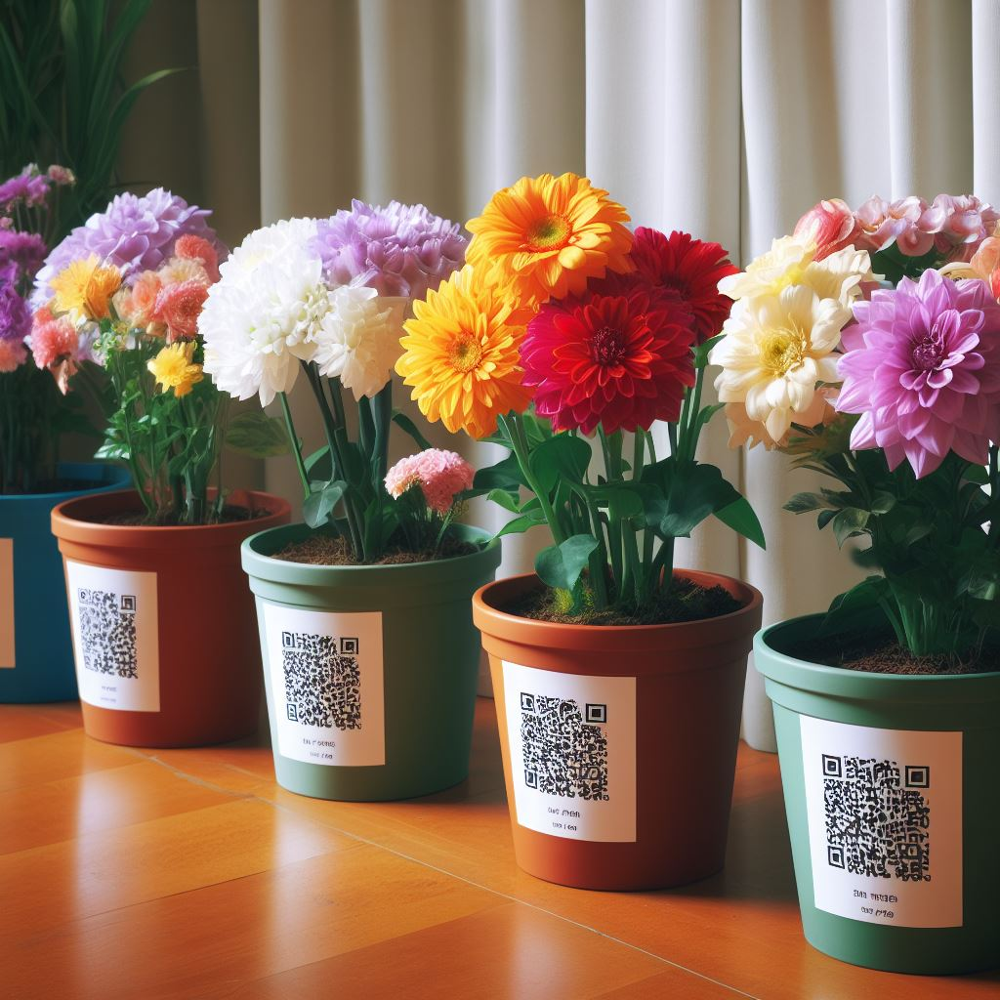

# Smart Gardening

QR Codes (oder alternativ RFID-Tags) an Töpfen.
Das scannen des QR Codes via Smartphone zeigt mir an welche Pflanze sich im Topf befindet, Informationen zum aktuellen Status der Pflanze, sowie welche Bedürfnisse sie hat. 

## Status

- Wasser / zuletzt gegossen
  - über Feuchtigkeitssensor
  - Warnung bei zu geringer Feuchtigkeit
- Pflegehinweise:
	- benötigte Wassermenge
	- Lichtverhältnisse
	- Temperaturen
  - Pflegehistorie
- Kommentarfunktion
- Actions (Umtopfen, Erde erneuern, Begutachten - Ticketsystem)

## Nötige Hardware

- Feuchtigkeitssensor
- Raspberry Pi
- Drucker für QR codes
- Pflanzen und Töpfe

## Nötige Sofware

- Python Backend
- SQL Datenbank (SQLite)
- PHP Seite als Frontend

## Gründe/Vorteile des Projektes

- genaue Pflegeanweisungen einfach übers Smartphone ablesbar
- Pflanzenstatus abrufbar
- Verbessert Nachhaltigkeit durch bessere Ressourceneffizienz
  - reduziert Wasserverbrauch durch smarte Bewässerung
  - Einsatz von Pestiziden wird minimiert
- auch weniger erfahrenes Personal kann einfach Anweisungen nachvollziehen
- kann wiederverwendet werden für Bildungszwecke, wie z.B. einen Pflanzenkatalog
- Dashboard Monitoring über alle aktiven Pflanzen
- reduziert Fehlerrate beim Pflegen von besonderen Pflanzen
- Benachrichtungen
- Anzeige von Wetterinformationen für Outdoor Pflanzen

## Zukünftig erdenkbare Features (kein Bestandteil des Prototypen)

- AI Bilderkennung für Pflanzenkrankheiten 
- Anbindung automatische Bewässerungsanlagen
- Im Pflanzenstatus-Screen: Beratungsdienst / Community Thread mit Pflanzendetails
- Smart Home Integration für Belüftung/Licht etc.
- Integration von Wetteranzeige